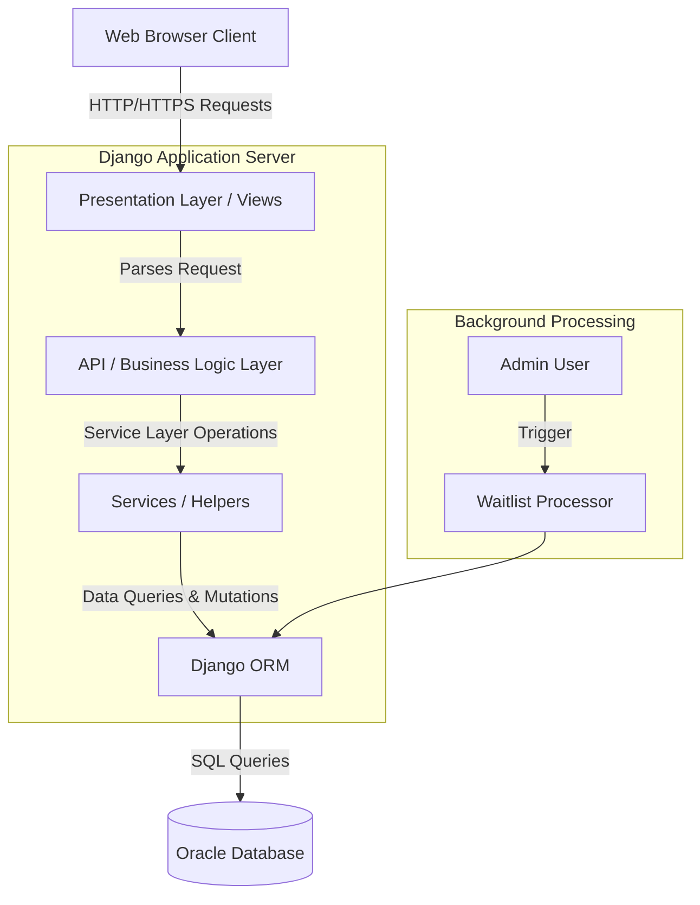

# System Architecture

The CampusHub application is built using a modern 3-tier architecture, implemented via the Django framework. The architecture strictly separates concerns between the presentation, business logic, and data access layers.

## Layer Descriptions

1. **Presentation Layer (Django Templates & Views):** Renders the Light UI templates, handling user interactions and displaying data fetched from the backend.
2. **API & Business Layer (Django REST Framework / Services):** Validates incoming data, implements core business rules (like checking event capacity), and serializes data.
3. **Data Access Layer (Django ORM):** Abstracts complex SQL queries into Python objects, ensuring safe transactions against the database.
4. **Database (Oracle):** Provides robust enterprise-grade persistence for students, events, registrations, and volunteer tasks.