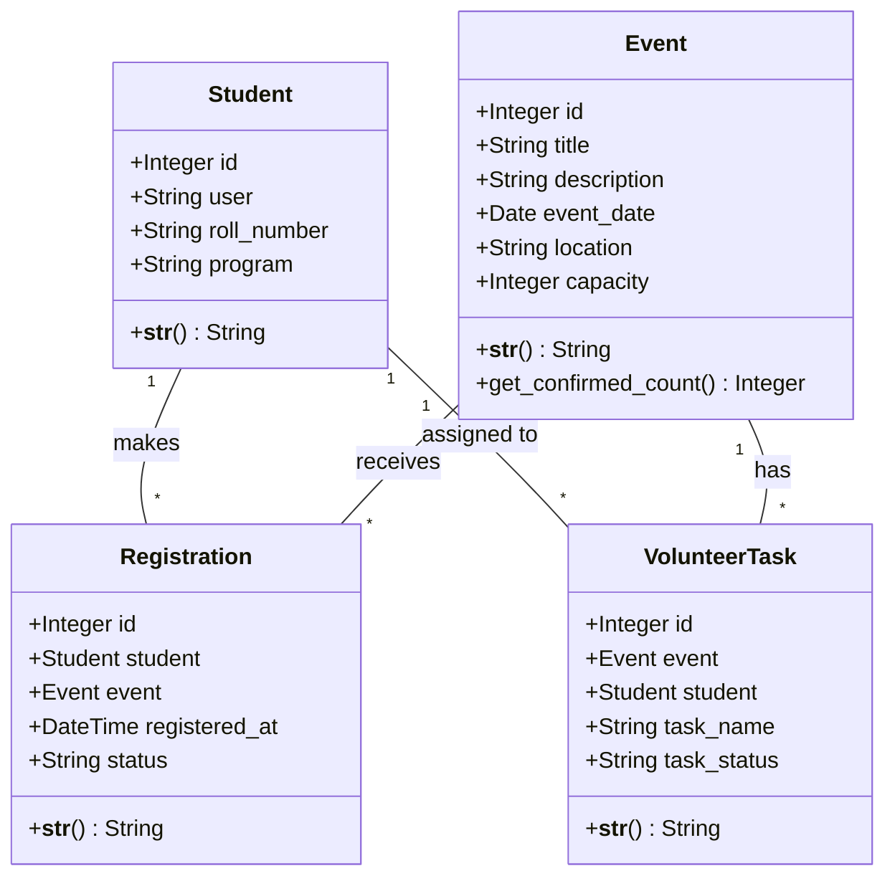
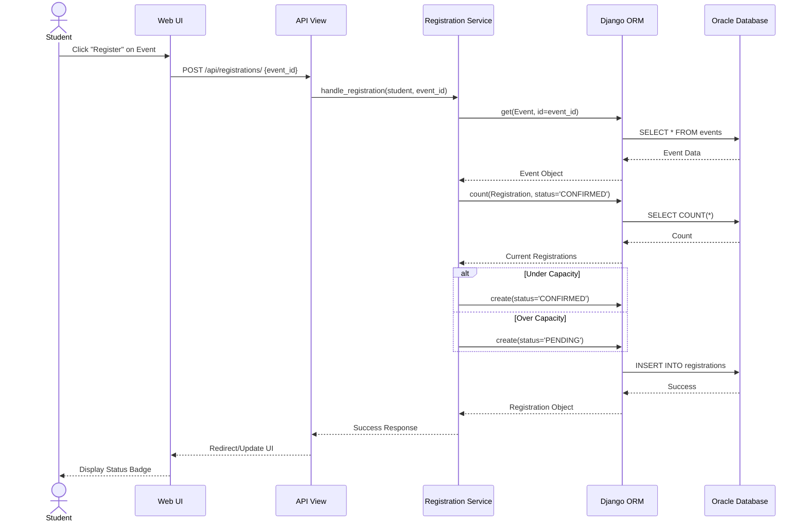

# UML Class Diagram

This diagram represents the actual Django ORM domain models implemented in the core API application.



# UML Sequence Diagram — Event Registration

This sequence demonstrates how a student successfully registers for an event, interacting with the Presentation, View, Service, and Data Access layers.



# UML Activity Diagram — Background Waitlist Processing

This demonstrates the core asynchronous background operation triggered by administrators to process the waitlist queue.

```mermaid
activityDiagram
    start
    :Admin clicks "Process Queue";
    :POST /api/registrations/process/;
    :Trigger Background Task;
    
    :Retrieve All Future Events;
    while (More Events?) is (yes)
        :Calculate Remaining Capacity\n(Total - Confirmed);
        if (Remaining Capacity > 0) then (yes)
            :Retrieve PENDING Registrations\n(Ordered by registered_at);
            while (Remaining Capacity > 0 && More Pending?) is (yes)
                :Update Registration Status to CONFIRMED;
                :Decrement Remaining Capacity;
            endwhile (no)
        else (no)
            :Skip Event;
        endif
    endwhile (no)
    
    :Commit Transaction to Oracle DB;
    :Return Success;
    stop
```
