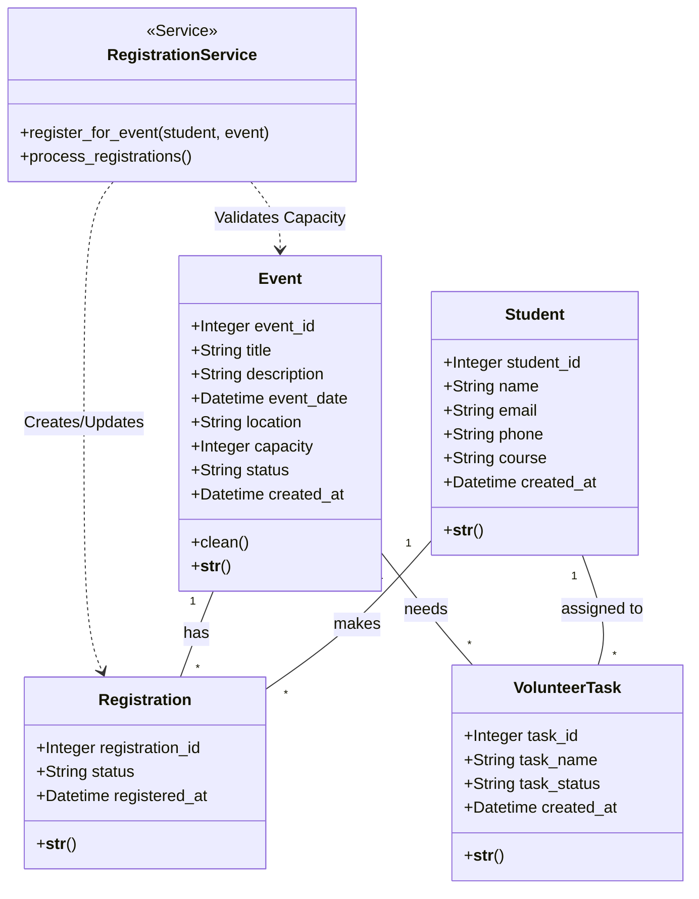

# Class Diagram

This diagram visualizes the high-level Django ORM Classes and Domain Models for the CampusHub application.

```mermaid
classDiagram
    class Student {
        +Integer student_id
        +String name
        +String email
        +String phone
        +String course
        +Datetime created_at
        +__str__()
    }

    class Event {
        +Integer event_id
        +String title
        +String description
        +Datetime event_date
        +String location
        +Integer capacity
        +String status
        +Datetime created_at
        +clean()
        +__str__()
    }

    class Registration {
        +Integer registration_id
        +String status
        +Datetime registered_at
        +__str__()
    }

    class VolunteerTask {
        +Integer task_id
        +String task_name
        +String task_status
        +Datetime created_at
        +__str__()
    }
    
    class RegistrationService {
        <<Service>>
        +register_for_event(student, event)
        +process_registrations()
    }

    Student "1" -- "*" Registration : makes
    Event "1" -- "*" Registration : has
    
    Student "1" -- "*" VolunteerTask : assigned to
    Event "1" -- "*" VolunteerTask : needs
    
    RegistrationService ..> Registration : Creates/Updates
    RegistrationService ..> Event : Validates Capacity
```
