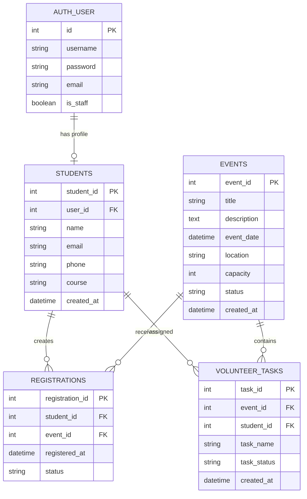

# Database Documentation

# 8. Database Design

# 8.1 Database Layer

Oracle Database is the actual persistent database.
The application should NOT use SQLite for the final implementation.
The logical structure is:
```text
Django ORM
     ↓
Oracle Database
     ↓
Tables
```
Main application tables: STUDENTS, EVENTS, REGISTRATIONS, VOLUNTEER_TASKS.
Django authentication tables may also exist.
## 8.2 Database Schema

The application uses four core linked application tables.

```text
STUDENTS
EVENTS
REGISTRATIONS
VOLUNTEER_TASKS
```

Django's authentication tables are separate framework-managed tables and are not counted as replacements for the four core application tables.

---

---

# 9. Entity Relationship Design



---

---

# 10. Table Specifications

## 10.1 STUDENTS

Purpose: Store application-specific student information.

| Column | Type | Constraint |
|---|---|---|
| student_id | Oracle NUMBER | PK |
| user_id | Oracle NUMBER | FK to AUTH_USER |
| name | VARCHAR2 | NOT NULL |
| email | VARCHAR2 | UNIQUE, NOT NULL |
| phone | VARCHAR2 | NOT NULL |
| course | VARCHAR2 | NOT NULL |
| created_at | TIMESTAMP | NOT NULL |

Relationship:

```text
User 1 ─── 0..1 Student
Student 1 ─── N Registrations
Student 1 ─── N VolunteerTasks
```

## 10.2 EVENTS

| Column | Type | Constraint |
|---|---|---|
| event_id | Oracle NUMBER | PK |
| title | VARCHAR2 | NOT NULL |
| description | CLOB | NULL allowed |
| event_date | TIMESTAMP | NOT NULL |
| location | VARCHAR2 | NOT NULL |
| capacity | NUMBER | NOT NULL, > 0 |
| status | VARCHAR2 | NOT NULL |
| created_at | TIMESTAMP | NOT NULL |

Allowed status:

```text
OPEN
CLOSED
COMPLETED
CANCELLED
```

## 10.3 REGISTRATIONS

| Column | Type | Constraint |
|---|---|---|
| registration_id | Oracle NUMBER | PK |
| student_id | NUMBER | FK |
| event_id | NUMBER | FK |
| registered_at | TIMESTAMP | NOT NULL |
| status | VARCHAR2 | NOT NULL |

Allowed status:

```text
PENDING
CONFIRMED
CANCELLED
```

Unique rule:

```text
A student cannot have two active registrations for the same event.
```

Recommended database uniqueness:

```text
UNIQUE(student_id, event_id)
```

## 10.4 VOLUNTEER_TASKS

| Column | Type | Constraint |
|---|---|---|
| task_id | NUMBER | PK |
| event_id | NUMBER | FK |
| student_id | NUMBER | FK |
| task_name | VARCHAR2 | NOT NULL |
| task_status | VARCHAR2 | NOT NULL |
| created_at | TIMESTAMP | NOT NULL |

Allowed task status:

```text
ASSIGNED
IN_PROGRESS
COMPLETED
CANCELLED
```

---

---

# 11. Database Rules

1. Foreign keys must be enforced.
2. Required fields must use NOT NULL.
3. Primary keys must be enforced.
4. Appropriate unique constraints must be enforced.
5. Event capacity must be greater than zero.
6. Registration status must use defined values.
7. Event status must use defined values.
8. Volunteer task status must use defined values.
9. Do not store plaintext passwords in application tables.
10. Django authentication handles passwords.

---

---

# 12. ORM Models

Django ORM is the primary data-access mechanism.
Example:
```python
Event.objects.filter(status="OPEN")
```
The ORM communicates with Oracle through Django's Oracle database backend.
Avoid writing raw SQL unless it is specifically needed for an assignment query or Oracle-specific operation.
Django models MUST correspond to the database entities.

Expected model classes:

```text
Student
Event
Registration
VolunteerTask
```

Django's built-in User model will handle authentication.

Use relationships such as:

```python
ForeignKey
OneToOneField
```

where appropriate.

The ORM should be the normal data-access mechanism.

Raw SQL may be used for the specifically required complex queries when necessary, but the reason must be documented.

---

---

# 25. Required Related-Entity Query 1

## Student → Events

Purpose:

Show all events registered by a particular student.

Conceptual SQL:

```sql
SELECT
    s.name,
    e.title,
    e.event_date,
    e.location,
    r.status
FROM students s
JOIN registrations r
    ON s.student_id = r.student_id
JOIN events e
    ON r.event_id = e.event_id
WHERE s.student_id = :student_id;
```

API:

```http
GET /api/students/{id}/events/
```

---

---

# 26. Required Related-Entity Query 2

## Event → Students

Purpose:

Show all students registered for an event.

```sql
SELECT
    e.title,
    s.name,
    s.email,
    r.status
FROM events e
JOIN registrations r
    ON e.event_id = r.event_id
JOIN students s
    ON r.student_id = s.student_id
WHERE e.event_id = :event_id;
```

API:

```http
GET /api/events/{id}/registrations/
```

---

---

# 27. Required Related-Entity Query 3

## Event → Volunteer Tasks → Students

Purpose:

Show volunteer assignments for an event.

```sql
SELECT
    e.title,
    s.name,
    v.task_name,
    v.task_status
FROM volunteer_tasks v
JOIN events e
    ON v.event_id = e.event_id
JOIN students s
    ON v.student_id = s.student_id
WHERE e.event_id = :event_id;
```

API:

```http
GET /api/events/{id}/volunteer-tasks/
```

---

---

# 28. Complex Query 1 — Event Participation Report

The report must use at least three related entities.

Required output:

```text
Event
Total Registrations
Confirmed Registrations
Cancelled Registrations
Volunteer Count
Completed Volunteer Tasks
```

Relationships involved:

```text
EVENTS
  ↓
REGISTRATIONS
  ↓
STUDENTS

EVENTS
  ↓
VOLUNTEER_TASKS
  ↓
STUDENTS
```

API:

```http
GET /api/reports/events/{id}/participation/
```

Example response:

```json
{
  "event": {
    "id": 4,
    "title": "Blood Donation Camp"
  },
  "total_registrations": 48,
  "confirmed_registrations": 42,
  "cancelled_registrations": 2,
  "volunteer_count": 12,
  "completed_tasks": 8
}
```

---

---

# 29. Complex Query 2 — Student Participation Report

Required output:

```text
Student
Course
Total Events
Confirmed Events
Volunteer Tasks
Completed Tasks
```

Relationships involved:

```text
STUDENTS
  ↓
REGISTRATIONS
  ↓
EVENTS

STUDENTS
  ↓
VOLUNTEER_TASKS
  ↓
EVENTS
```

API:

```http
GET /api/reports/students/{id}/participation/
```

Example response:

```json
{
  "student": {
    "id": 1,
    "name": "Ram Sharma",
    "course": "BSc CSIT"
  },
  "total_events": 7,
  "confirmed_events": 6,
  "volunteer_tasks": 4,
  "completed_tasks": 3
}
```

---

---

# 40. Database Scripts

The project MUST provide:

```text
database/schema.sql
database/seed.sql
database/queries.sql
```

## schema.sql

Must create the application database structures required for Oracle.

## seed.sql

Must provide realistic demo data.

Minimum useful data:

```text
10+ students
5+ events
15+ registrations
8+ volunteer tasks
```

## queries.sql

Must include:

- Required relationship query 1
- Required relationship query 2
- Required relationship query 3
- Complex query 1
- Complex query 2

---

---

# 41. Seed Data Scenario

Use realistic campus events.

Example:

```text
Blood Donation Camp
Web Development Workshop
College Sports Day
Career Guidance Seminar
Cultural Festival
```

Example volunteer tasks:

```text
Registration Desk
Stage Management
Technical Support
Guest Coordination
Photography
Crowd Management
```

Do not use meaningless records such as:

```text
test1
abc
xyz
foo
```

---