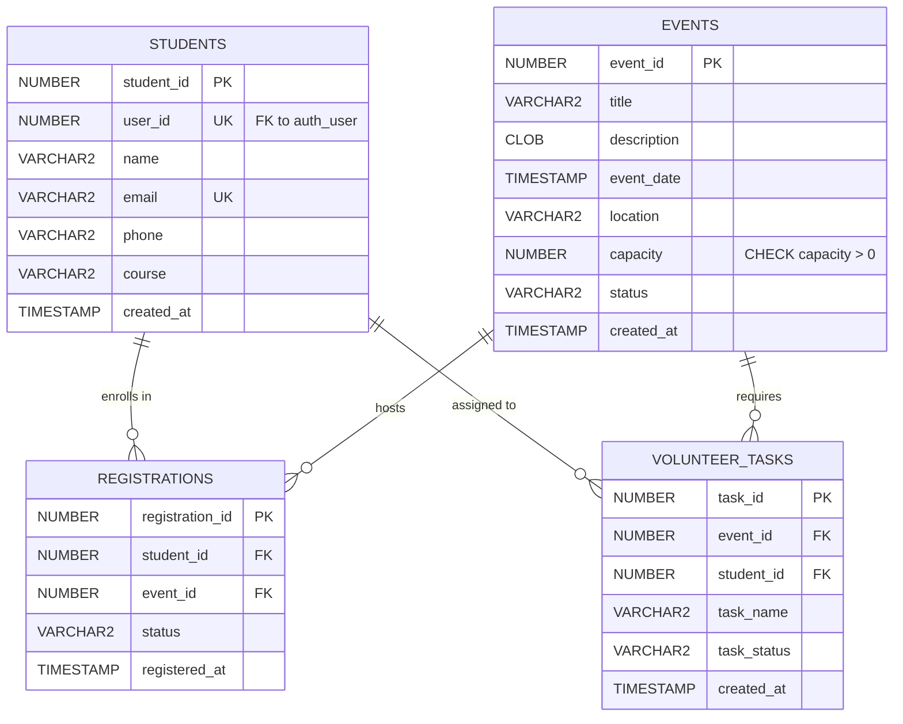

# Entity Relationship Diagram

This diagram visualizes the table entities and their relationships within the Campus Event & Volunteer Management System Oracle Database.

```mermaid
erDiagram
    STUDENTS ||--o{ REGISTRATIONS : "enrolls in"
    EVENTS ||--o{ REGISTRATIONS : "hosts"
    
    STUDENTS ||--o{ VOLUNTEER_TASKS : "assigned to"
    EVENTS ||--o{ VOLUNTEER_TASKS : "requires"

    STUDENTS {
        NUMBER student_id PK
        NUMBER user_id UK "FK to auth_user"
        VARCHAR2 name
        VARCHAR2 email UK
        VARCHAR2 phone
        VARCHAR2 course
        TIMESTAMP created_at
    }

    EVENTS {
        NUMBER event_id PK
        VARCHAR2 title
        CLOB description
        TIMESTAMP event_date
        VARCHAR2 location
        NUMBER capacity "CHECK capacity > 0"
        VARCHAR2 status
        TIMESTAMP created_at
    }

    REGISTRATIONS {
        NUMBER registration_id PK
        NUMBER student_id FK
        NUMBER event_id FK
        VARCHAR2 status
        TIMESTAMP registered_at
    }

    VOLUNTEER_TASKS {
        NUMBER task_id PK
        NUMBER event_id FK
        NUMBER student_id FK
        VARCHAR2 task_name
        VARCHAR2 task_status
        TIMESTAMP created_at
    }
```
