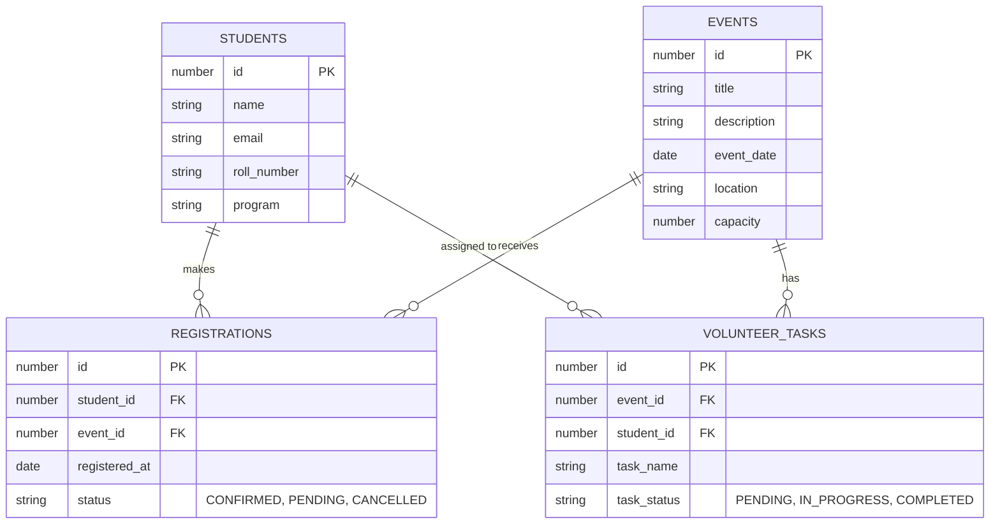

# Entity-Relationship Diagram

This diagram visualizes the actual logical schema implemented in the Oracle Database via the Django ORM.

```mermaid
erDiagram
    STUDENTS ||--o{ REGISTRATIONS : "makes"
    STUDENTS ||--o{ VOLUNTEER_TASKS : "assigned to"
    EVENTS ||--o{ REGISTRATIONS : "receives"
    EVENTS ||--o{ VOLUNTEER_TASKS : "has"

    STUDENTS {
        number id PK
        string name
        string email
        string roll_number
        string program
    }

    EVENTS {
        number id PK
        string title
        string description
        date event_date
        string location
        number capacity
    }

    REGISTRATIONS {
        number id PK
        number student_id FK
        number event_id FK
        date registered_at
        string status "CONFIRMED, PENDING, CANCELLED"
    }

    VOLUNTEER_TASKS {
        number id PK
        number event_id FK
        number student_id FK
        string task_name
        string task_status "PENDING, IN_PROGRESS, COMPLETED"
    }
```
