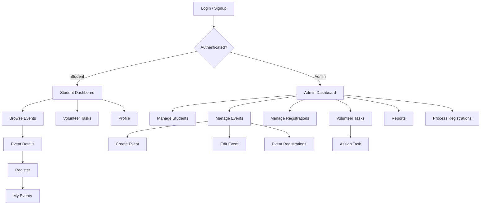

# Product Documentation

# 2. Project Overview

## 2.1 Product Name

**Campus Event & Volunteer Management System**

## 2.2 Problem

Colleges organize workshops, sports programs, blood donation programs, seminars, cultural events, and other activities. Managing events, student registrations, and volunteer assignments manually can become difficult.

This application provides a centralized system for:

- Managing students
- Creating and managing campus events
- Registering students for events
- Assigning volunteer tasks
- Tracking participation
- Producing useful reports

The system is intentionally small but demonstrates a complete enterprise application lifecycle.

---

---

# 3. Scope

## 3.1 Included

The first version MUST include:

- User signup
- User login
- User logout
- Role-based access
- Student management
- Event management
- Event registration
- Volunteer task management
- CRUD operations for all application tables
- Related-entity queries
- Complex multi-table queries
- Background/asynchronous registration processing
- Dashboard
- Reports
- API endpoints
- Oracle database
- Django ORM
- DTO/API serializers
- Business/service layer
- Validation
- Error handling
- Testing
- ER diagram
- UML class diagram
- Navigation diagram
- Installation documentation
- User manual
- Assignment report

## 3.2 Explicitly Out of Scope

Do NOT build:

- Public marketing landing page
- Payment system
- Email/SMS integration
- Real-time chat
- AI functionality
- Mobile application
- Social media features
- Complex notification infrastructure
- Microservices
- Kubernetes
- Cloud deployment
- Advanced analytics
- Unnecessary third-party integrations

The project should demonstrate database and enterprise application concepts, not become a commercial product.
## 3.3 Scope Rule

Keep the project intentionally manageable.
Prioritize:
1. Authentication
2. Student management
3. Event management
4. Event registration
5. Volunteer task management
6. Required CRUD operations
7. Required related queries
8. Required complex queries
9. Background processing
10. Web GUI
11. Documentation
12. Testing and final demo

Do not add unnecessary features simply to make the project appear larger.
The goal is a **complete, working, well-structured Enterprise Application**, not a large commercial product.

---

---

# 4. Users and Roles

There are two application roles.

## 4.1 Student

A student can:

- Sign up
- Log in
- View available events
- View event details
- Register for an event
- View their registrations
- Cancel an eligible registration
- View assigned volunteer tasks
- Update/view their profile

## 4.2 Admin

An administrator can:

- Log in
- View dashboard
- Create events
- View events
- Update events
- Delete events
- View registered students
- Manage registrations
- Create volunteer tasks
- Assign volunteer tasks
- Update volunteer task status
- View reports
- Manage students where appropriate
- Trigger background registration processing

---

---

# 5. Main User Journeys

The application must be understandable as a complete journey.

## 5.1 Student Journey

```text
Signup
  ↓
Login
  ↓
Student Dashboard
  ↓
Browse Events
  ↓
Event Details
  ↓
Register
  ↓
Registration Confirmation
  ↓
My Events
  ↓
View/Cancel Registration
  ↓
View Volunteer Tasks
  ↓
Profile
```

## 5.2 Admin Journey

```text
Login
  ↓
Admin Dashboard
  ↓
Manage Events
  ↓
Create/Edit/Delete Event
  ↓
View Event Registrations
  ↓
Manage Registrations
  ↓
Assign Volunteer Tasks
  ↓
Process Registrations
  ↓
View Reports
```

## 5.3 Technical Request Journey

Example:

```text
Browser
  ↓
Django URL
  ↓
View/API Controller
  ↓
Serializer / DTO validation
  ↓
Business Service
  ↓
Django ORM
  ↓
Oracle Database
  ↓
Service result
  ↓
Serializer
  ↓
HTTP Response
  ↓
Browser
```

---

---

# 23. Registration Business Rules

When a student registers:

1. Student must exist.
2. Event must exist.
3. Event must be OPEN.
4. Event must not have exceeded capacity.
5. Student must not already have a registration for that event.
6. Registration should initially be PENDING unless the defined processing flow confirms it.
7. Create the registration.
8. Return a meaningful result.

The service must perform these checks.

---

---

# 24. Event Business Rules

1. Title is required.
2. Event date is required.
3. Location is required.
4. Capacity must be greater than zero.
5. Event cannot be registered for when CLOSED, COMPLETED, or CANCELLED.
6. An event with existing registrations should not be casually deleted without handling its registrations.
7. Admin controls event management.

---

---

# 31. Web Application Pages

No public landing/marketing page is required.

## Authentication

```text
/signup
/login
/logout
```

## Student Pages

```text
/student/dashboard
/student/events
/student/events/<id>
/student/my-events
/student/volunteer-tasks
/student/profile
```

## Admin Pages

```text
/admin/dashboard
/admin/students
/admin/events
/admin/events/create
/admin/events/<id>/edit
/admin/events/<id>/registrations
/admin/registrations
/admin/volunteer-tasks
/admin/reports
```

---

---

# 32. Navigation



---

---

# 33. Dashboard Requirements

## Student Dashboard

Display:

- Welcome message
- Number of registered events
- Upcoming events
- Recent registrations
- Assigned volunteer tasks

## Admin Dashboard

Display:

- Total students
- Total events
- Total registrations
- Pending registrations
- Upcoming events
- Quick actions
- Recent registrations

Do not build advanced charts unless they are useful and easy to maintain.

---

---

# 34. UI Guidelines

Use a clean academic enterprise dashboard.

Requirements:

- Responsive layout
- Sidebar or top navigation
- Tables for CRUD records
- Forms for create/edit
- Confirmation for destructive actions
- Clear success messages
- Clear validation errors
- Consistent buttons
- Consistent page titles
- Loading states where needed
- Empty states for tables with no data

Do not spend excessive time on visual effects.

Functionality is more important than visual complexity.

---

---

# 35. CRUD Requirements

CRUD MUST exist for each core application table.

## Students

```text
Create
Read
Update
Delete
```

## Events

```text
Create
Read
Update
Delete
```

## Registrations

```text
Create
Read
Update
Delete/Cancel
```

## Volunteer Tasks

```text
Create
Read
Update
Delete
```

The lecturer must be able to see these operations working.

---